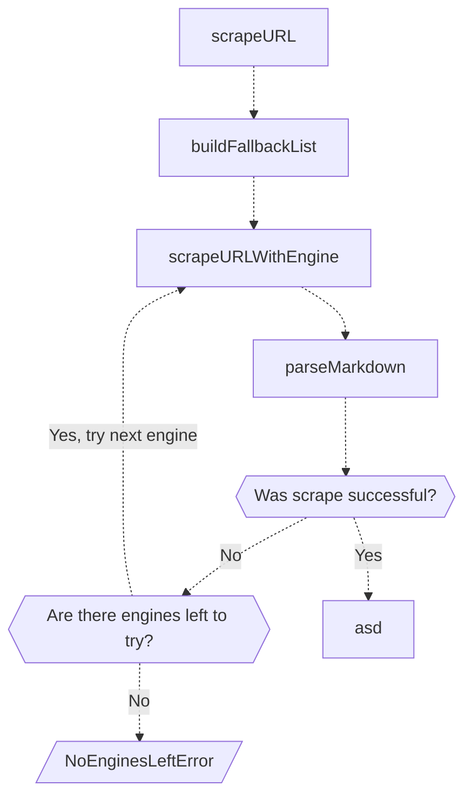

# `scrapeURL`
New URL scraper for Firecrawl

## Signal flow

## Differences from `WebScraperDataProvider`
 - The job of `WebScraperDataProvider.validateInitialUrl` has been delegated to the zod layer above `scrapeUrl`.
 - `WebScraperDataProvider.mode` has no equivalent, only `scrape_url` is supported.
 - You may no longer specify multiple URLs.
 - Built on `v1` definitons, instead of `v0`.
 - PDFs are now converted straight to markdown using LlamaParse, instead of converting to just plaintext.
 - DOCXs are now converted straight to HTML (and then later to markdown) using mammoth, instead of converting to just plaintext.
 - Using new JSON Schema OpenAI API -- schema fails with LLM Extract will be basically non-existant.

## Self-host engines (no fire-engine)

When `FIRE_ENGINE_BETA_URL` is unset, the Playwright microservice (`PLAYWRIGHT_MICROSERVICE_URL`) is the browser engine.

| Format | Self-host path |
| --- | --- |
| `screenshot` / `screenshot@fullPage` | Playwright `page.screenshot` → data URL on `document.screenshot` |
| `branding` | Playwright `page.evaluate(getBrandingScript())` → `actions.javascriptReturns` → `deriveBrandingFromActions` → `lib/branding` |

If either format is requested and the field is missing after transformers, the scrape fails with `SCRAPE_SCREENSHOT_FAILED` / `SCRAPE_BRANDING_FAILED` (no warn-only success).

LLM extract call sites use `getModel()`; set `MODEL_PROVIDER` + `MODEL_NAME` to switch providers without editing hardcoded `"openai"` arguments. Multi-provider specialty paths use `getModelExact()`.
