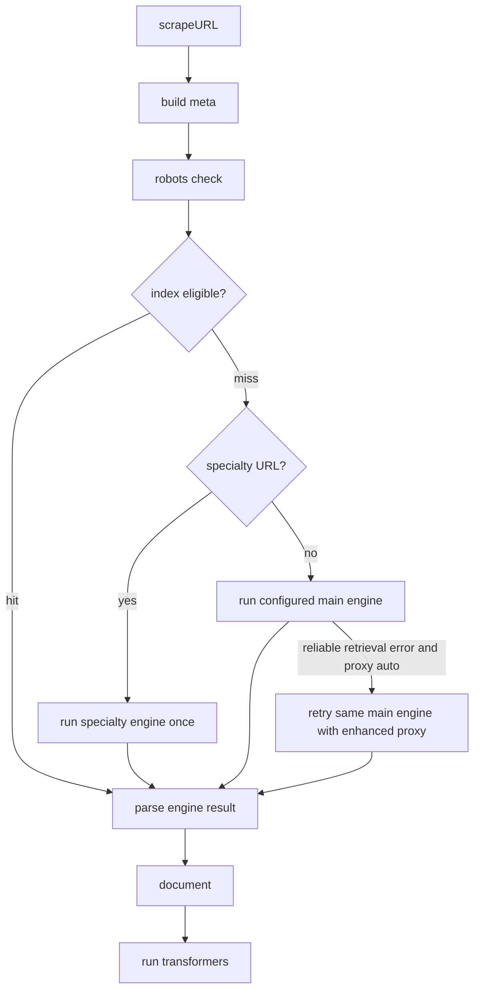

# `scrapeURL`

Single-URL scraper for Firecrawl.

## Signal flow

## Engine selection

- Feature support does not select engines. Unsupported features produce warnings on the returned document.
- Parsers materialize `Document` from `EngineScrapeResult`. HTML is the default parser; PDF and document parsers inspect fetched file payloads from the engine result.
- Specialty URL engines are terminal once selected.
- `proxy: "auto"` tries the main engine with basic proxy first, then retries the same main engine with enhanced proxy only when the engine raises `ReliableRetrievalError`.
